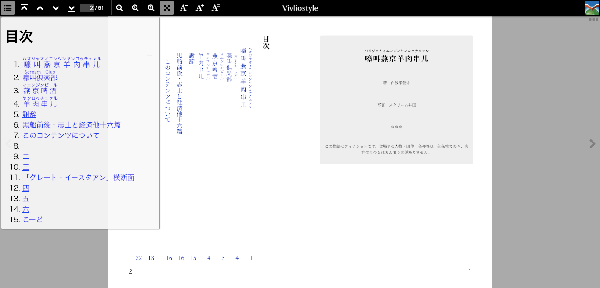
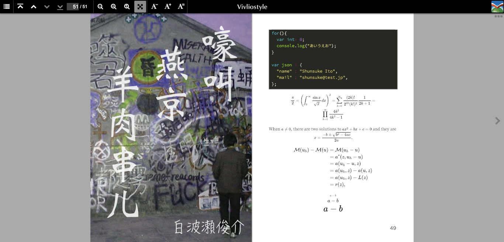

# viBook theme
Vivliostyle Book style Theme for 
"Hugo - Static Site Generator"


# Features
- Generate OPF(Open Packaging Format)
- Generate Navigation (Table of Contents) 
- 3 Content Types
  - Cover : for cover pages (full cover image) 
  - Nav : navigation page
  - Pages : main contents
- Configure Book style (@page etc)
  - @page size
  - Writing Mode : vertical-rl or horizontal-tb
  - Page Progression Direction : rtl / ltr
  - ToC controll
- Shortcode
  - Math : for Vivliostyle MathJax Future
  - Section : All purpose content block
- Hugo Pipes (SASS)
- (experimental) Denden Future
  - TYC class
  - Ruby (group ruby)

# Screenshot




# Installation

In the root of your Hugo site directory run:

```shell
git clone git@github.com:shunito/vibook.git themes/vibook
```

## fonts
Download your favorite font
 and copy it to the following directory.

```
~themes/vibook/static/css/fonts/
```

and Add @font-face Settings to CSS file
```
~themes/vibook/assets/css/_typography.scss
```

# Configuration
This is an example of site config.toml:

```toml
[params]
  autoToC = true 
  dispToC = true
  tocDepth = 3
  pageSize = "A5"
  writingMode = "vertical-rl"
  hasCover = true
  pageProgressionDirection = "rtl"
  dendenFuture = true
```

- autoToC : 目次ページの自動生成
- dispToC : 目次ページを表示に利用（OPFに含める）
- tocDepth : 目次自動生成に利用する"H1"〜"H6"の設定。3は"H1"から"H3"を目次として抽出します。
- pageSize : Vivliostyleで出力するページサイズの設定
  以下のサイズは文字列で設定できます。  
  A5 | A4 | A3 | B5 | B4 | letter | legal | ledger  
  それ以外の設定をする場合には、CSS(book.scss)を修正してください。
  landscapeとportraitも使えるはず。（要検証）
- writingMode : 本全体での縦書/横書の基本設定。ページ単体で設定された場合はページ側が有効。
- hasCover : カバーページをOPFに出力するかどうか。
- pageProgressionDirection : ページの綴じ方向
  - "rtl" : 右から左
  - "ltr" : 左から右
- dendenFuture : （実験的機能）でんでんマークダウン記法を有効にするかどうか。現在のところ縦中横とルビ記法（グループルビのみ）だけの中途半端な状態。

# Pros
viBookは静的サイトジェネレータHugoの強力なサイト（ページ）生成機能にVivliostyleによるCSS出版の機能を組み合わせ、複数のMarkdownファイルからEPUBやPDFを生成する作業を楽にします。

- Hugoの機能から
  - 組み込みの軽量サーバによるリアルタイムプレビュー。 （原稿更新すると自動的にリロードしてくれます。）
  - Hugoのテンプレート機能による柔軟なインクルードや目次などリストの生成。
    - content.opfと論理目次（nav.html）の半自動生成により、Vivliostyleに擬似的にEPUBとして認識させ、全ページ通してのプレビューが可能です。
  - ShortcodesによるMarkdownの拡張。  
  [標準で準備されているShortcodes](https://gohugo.io/content-management/shortcodes/)だけでもいろいろできます。
    - figure は特に使っていくと良さそう。
    - 組み込みのコードハイライト
    - viBookではmathとsectionの2つを用意。
      - math はmarkdown変換を通さずVivliostyleのMathJaxに値を渡します。
      - section はclassを追加するための汎用のブロックです。CSSの拡張と合わせるといろいろ捗ります。
  - [Hugo Pipes](https://gohugo.io/hugo-pipes/)によるCSSの効率的な管理。
    - Hugoの変数をSCSS内で利用できるため、ページサイズをCSSに反映したり（今のところこれくらいしか使ってないですが）
    - ※Hugo Pipesを使うにはHugo Extended版が必要です。
- Vivliostyleの機能から
  - @Page、ノンブル、ページ数カウンターなど。
  - Mathjax（HugoのShortCodeと組み合わせ）
  - フォントをダウンロードしてCSSで指定すれば、サブセット化してくれるみたい。PDFにするには十分な感じ。
    - 生成したPDFをイラレで開いてPDF/X-4とかで保存し直すのが印刷向けには一番楽みたい。
  - Vivliostyleの使い方など、[公式ドキュメント](https://vivliostyle.github.io/vivliostyle.js/docs/ja/)参照でお願いします。

# Cons
いろいろ課題があります。  
- ページの並び順問題。  
  現在はページの持つ「Weight」の大きい順に並べています。 （[Hugoの標準](https://gohugo.io/templates/lists/#default-weight-date-linktitle-filepath) では、Weight > Date > LinkTitle > FilePath）  
  Weightの次はFilePathで並べたかったんですが方法がわからず、ページの日付で調整しています。PagesはFilePath（Filename）の並び固定にしてしまったほうがスッキリするかも。
- [でんでんコンバーター](https://conv.denshochan.com/)のモノルビ対応が再現できない。でんでんつよい。
  - でんでんコンバーターの表現を再現したかったので、viBookのサンプルにでんでんコンバーターのサンプル用コンテンツを記法を再調整の上で取り込んでいます。（もともとの文章は青空文庫からなので問題ないと思いますが）
- ハイライトしたCodeのブロックをVivliostyleを通すとレイアウトずれる。ほかレイアウトいろいろはCSS調整を細かくしないと結局難しい。SCSS使えるだけでも結構良いと思うけど。  
  そもそもハイライトの行数表示を使うと不要な空行が発生したり、もう少し研究が必要。
- Hugoと組み合わせられる[Mmark](https://gohugo.io/content-management/formats/#mmark)というMarkdown処理系があり、これを使うとBlock Level Attributes（classつけたり）など、さらに便利に使えると思ったんだけど、定義リスト記法が動かないなど問題あり。  
結局Markdownにsectionという汎用のShortcodesを作ってしのぎました。定義リストの件はHugoにPR送ったので取り込まれるといいなぁ。
- Readmeの途中で力尽きる作者の英語力
  - Hugoには多言語化機能があるので、色々できそうではあるんだけど。
  - Readmeをちゃんと英語で書いてテスト通ればHugoの[Hugo Themes website](https://themes.gohugo.io/)にも載せられるらしい。


# License
## [Vivliostyle](https://github.com/vivliostyle/vivliostyle.js)
Vivliostyle is Licensed under AGPL Version 3.

## viBook theme
The MIT License (MIT)


# Thanks
- [Hugo](https://gohugo.io/)
- [Vivliostyle](https://vivliostyle.org/)
- [電書ちゃんのでんでんコンバーター](https://conv.denshochan.com/)
